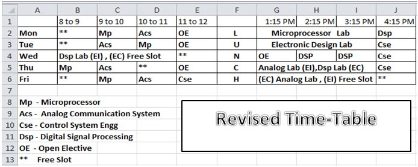

5th Semester, Electronics and Communication Engineering (ECE), NIT Rourkela
(Monsoon 2012).

 

Courses:
- [Analog Communication Systems](https://github.com/nitrece/analog-communication-systems)
- [Control System Engineering](https://github.com/nitrece/control-systems-engineering)
- [Digital Signal Processing](https://github.com/nitrece/digital-signal-processing)
- [Microprocessor](https://github.com/nitrece/microprocessor)
- [Digital Signal Processing Laboratory](https://github.com/nitrece/digital-signal-processing-laboratory)
- [Electronics Design Laboratory](https://github.com/nitrece/electronics-design-laboratory)
- [Microprocessor Laboratory](https://github.com/nitrece/microprocessor-laboratory)

 
 

 

